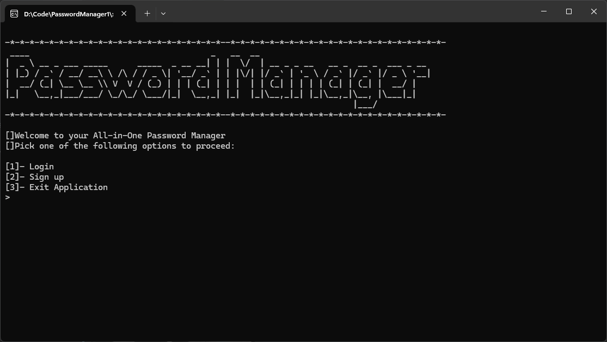
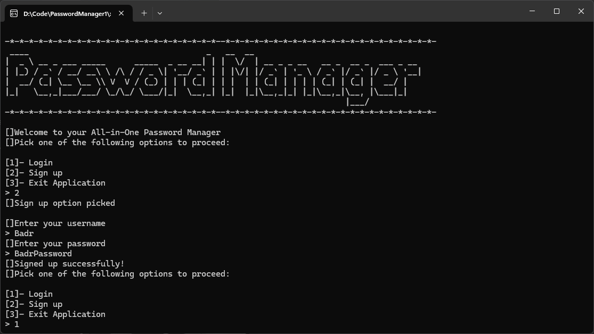
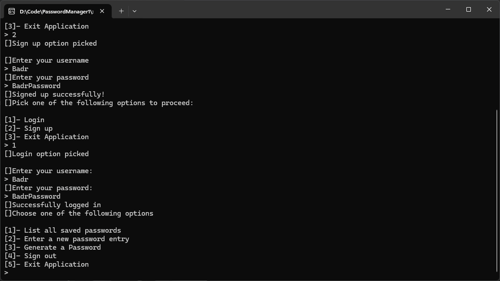
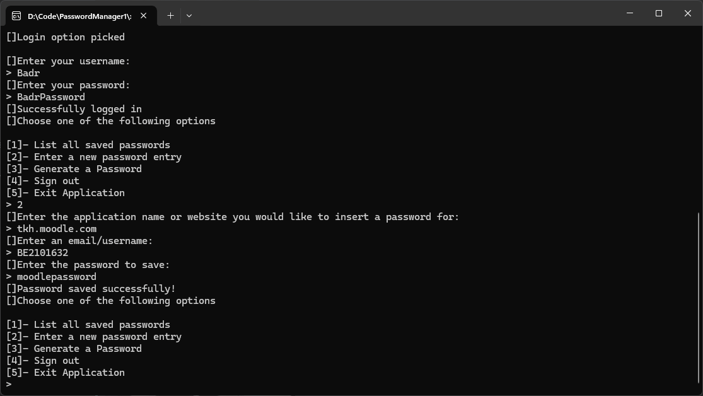
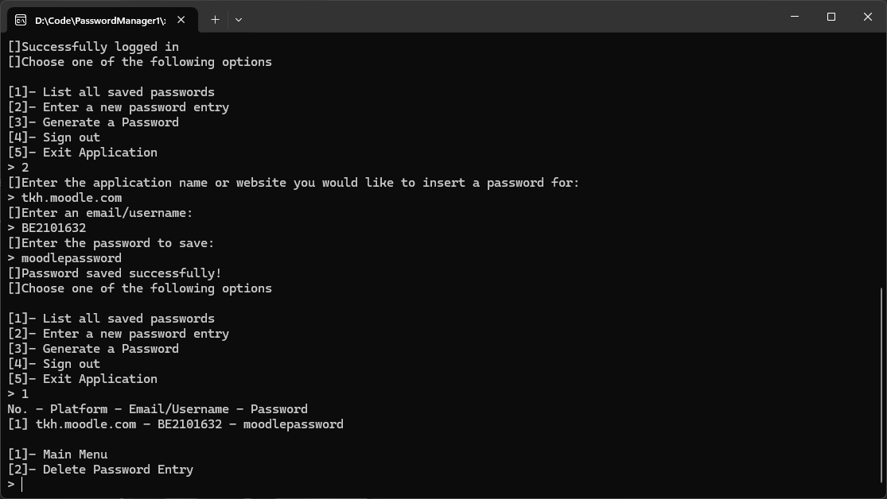
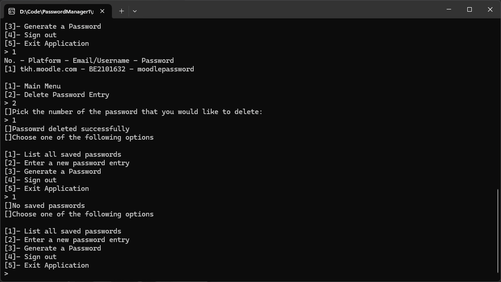

  

<h1>Local Password Manager</h1>

This repository is for a Local Password Manager

The password manager will have the following features

<ol>
<li>Support multiple users (By using a master password)</li>
<li>Password Generation</li>
<li>Password Retrevial</li>
</ol>

<h2>Application Demo</h2>

<h3>Sign Up</h3>

<h3>Login</h3>

<h3>Password Entry</h3>

<h3>Password retreival</h3>

<h3>Password entry deletion</h3>

<h3>Password Generator</h3>

